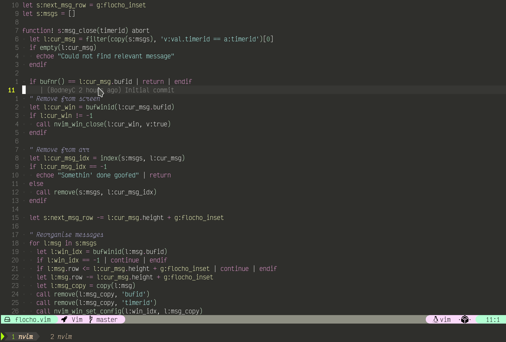

Flocho Vim
==========

**Flo**ating E**cho**...

Similar to [notification.vim](https://github.com/wsdjeg/notifications.vim/tree/master/plugin) but with a buffer/window for each notification, the reason being that you not want all of the notifications to disappear at once, e.g.:

Also, by having independent buffers for each message gives a greater potential control over each message, how it appears, when it disappears, etc.

## Practical Application

Can't really think of one at the minute...

## Usage

`:Echo "lemons dog fish"` will echo "lemons dog fish" in the top right

For further information, please see the [docs](./doc/flocho.txt)
